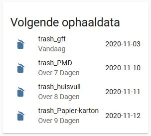

# Unofficial-recycleapp.be-HASS
Home Assistant sensor for Belgium's recycleapp.be
Very much based on the initial code of the Dutch https://github.com/xirixiz/homeassistant-afvalwijzer

Basic import of https://www.recycleapp.be data into Home Assistant.
Queries the different fractions up to a given amount of days in the future for a -currently- hardcoded address in the code.

Might look like this using https://github.com/thomasloven/lovelace-template-entity-row and https://github.com/thomasloven/lovelace-auto-entities on lovelace.

